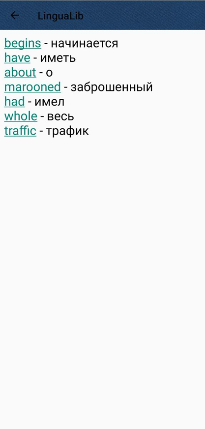

3. Реализация проекта в Android Studio

3.1 Главное меню

После прохождения авторизации через Firebase, описано в 2.6, мы попадаем на главное меню.

Рисунок 3.1 – Главное меню

Через главное меню мы можем попасть: в словарь, открыть книгу и основные параметры приложения.

Рисунок 3.2 – Параметры приложения

Этот код обрабатывает выбор пунктов меню в приложении. В зависимости от выбранного пункта меню, он выполняет соответствующее действие: открывает активность настроек, выполняет вход или выход из системы, открывает активность с информацией о программе. Каждый из методов clickOnAboutButton, clickOnLoginButton и clickOnLogoutButton выполняет соответствующее действие.

public boolean onOptionsItemSelected(MenuItem item) {
// Получаем ID выбранного элемента меню
int id = item.getItemId();

    // В зависимости от выбранного элемента меню выполняем соответствующее действие
    if (id == R.id.action_settings) {
        // Если выбран пункт меню "Настройки", открываем активность настроек
        startActivity(new Intent(this, SettingsActivity.class));
        return true;
    } else if (id == R.id.action_login) {
        // Если выбран пункт меню "Вход", вызываем метод для входа в систему
        clickOnLoginButton();
        return true;
    } else if (id == R.id.action_logout) {
        // Если выбран пункт меню "Выход", вызываем метод для выхода из системы
        clickOnLogoutButton();
        return true;
    } else if (id == R.id.action_about) {
        // Если выбран пункт меню "О программе", открываем активность с информацией о программе
        clickOnAboutButton();
        return true;
    } else {
        // Если выбран другой пункт меню, вызываем метод родительского класса
        return super.onOptionsItemSelected(item);
    }
}

private void clickOnAboutButton() {
// Создаем намерение для открытия активности с информацией о программе
Intent intent = new Intent(this, AboutActivity.class);
// Запускаем активность
startActivity(intent);
}

private void clickOnLoginButton() {
// Создаем намерение для открытия активности входа в систему
Intent intent = new Intent(this, LoginActivity.class);
// Запускаем активность и ожидаем результат
startActivityForResult(intent, OPEN_LOGIN_ACTIVITY);
}

private void clickOnLogoutButton() {
// Выходим из учетной записи Google
GoogleSignIn.getClient(this, new GoogleSignInOptions.Builder(GoogleSignInOptions.DEFAULT_SIGN_IN).build())
.signOut()
.addOnCompleteListener(this, new OnCompleteListener<Void>() {
@Override
public void onComplete(@NonNull Task<Void> task) {
// Выходим из учетной записи Firebase
FirebaseAuth.getInstance().signOut();
// Создаем намерение для открытия активности входа в систему
Intent i = new Intent(MainActivity.this, LoginActivity.class);
// Запускаем активность
startActivity(i);
}
});
}

3.2 Чтение из EPUB формата

Рисунок 3.3 – Чтение фрагментов

Этот код читает текст книги, переданный в активность, и разбивает его на слова. Затем он вычисляет количество страниц, которые потребуются для отображения всего текста, исходя из того, что на одной странице может быть не более 65 слов. Для каждой страницы он создает фрагмент, в который передает текст этой страницы. Текст страницы формируется из соответствующих слов.

public static Intent getIntent(Context context, String text) {
// Создание нового объекта Intent, который используется для запуска ScreenSlidePagerActivity.
Intent intent = new Intent(context, ScreenSlidePagerActivity.class);
// Добавление дополнительных данных (в данном случае, текста) в Intent.
// Эти данные будут доступны в ScreenSlidePagerActivity через getIntent().getStringExtra(ARGUMENT_TEXT).
intent.putExtra(ARGUMENT_TEXT, text);
// Возвращение объекта Intent, который может быть использован для запуска ScreenSlidePagerActivity с переданными данными.
return intent;
}

protected void onCreate(@Nullable Bundle savedInstanceState) {
super.onCreate(savedInstanceState);
setContentView(R.layout.activity_screen_slide);
// ...
// Получаем текст книги из переданных в активность данных
textOfBook = getIntent().getStringExtra(ARGUMENT_TEXT);
// Разбиваем текст книги на слова
arrWords = textOfBook.split(" ");
// Вычисляем количество страниц для отображения текста книги
numPages = (arrWords.length + 64) / 65;
// ...
}

private class ScreenSlidePagerAdapter extends FragmentStatePagerAdapter {
public ScreenSlidePagerAdapter(FragmentManager fm) {
super(fm);
}

    @Override
    public Fragment getItem(int position) {
        // Вычисляем начальный и конечный индексы для слов на текущей странице
        int beginIndex = 65 * position;
        int endIndex = Math.min(beginIndex + 65, arrWords.length);
        // Формируем текст страницы из соответствующих слов
        String pageText = String.join(" ", Arrays.copyOfRange(arrWords, beginIndex, endIndex));
        // Создаем фрагмент страницы с переданным текстом
        return ScreenSlidePageFragment.newInstance(position, pageText);
    }

    @Override
    public int getCount() {
        // Возвращаем общее количество страниц
        return numPages;
    }
}

3.3 Перевод выбранных слов

Рисунок 3.4 – Перевод выбранного слова

Этот метод выполняет перевод слова, используя сервис Google Translate. Он формирует запрос к API сервиса, отправляет его и получает ответ. В случае успешного выполнения запроса метод возвращает переведенное слово. Если в процессе выполнения запроса происходит ошибка, метод возвращает сообщение об ошибке [5].

private String translate(String word) {
// Ключ API для доступа к сервису перевода
String apiKey = "dbc9bca317mshf692cfa63415912p15478fjsn501958302cea+";
try {
// Формируем параметры запроса для перевода слова
String urlParameters = "q=" + URLEncoder.encode(word, "UTF-8") + "&target=ru&source=en";
byte[] postData = urlParameters.getBytes(StandardCharsets.UTF_8);

        // Создаем URL для запроса перевода
        URL url = new URL("https://google-translate1.p.rapidapi.com/language/translate/v2");
        HttpURLConnection conn = (HttpURLConnection) url.openConnection();

        // Устанавливаем параметры соединения
        conn.setDoOutput(true);
        conn.setRequestMethod("POST");
        conn.setRequestProperty("Content-Type", "application/x-www-form-urlencoded");
        conn.setRequestProperty("Accept-Encoding", "application/gzip");
        conn.setRequestProperty("X-RapidAPI-Key", apiKey);
        conn.setRequestProperty("X-RapidAPI-Host", "google-translate1.p.rapidapi.com");

        // Отправляем данные запроса
        try(DataOutputStream wr = new DataOutputStream(conn.getOutputStream())) {
            wr.write(postData);
        }

        // Получаем ответ от сервера
        InputStream response = conn.getInputStream();
        StringBuilder sb = new StringBuilder();
        try(BufferedReader reader = new BufferedReader(new InputStreamReader(response))) {
            String line;
            while ((line = reader.readLine()) != null) {
                sb.append(line);
            }
        }
        // Выводим ответ в лог
        Log.d("MyLogs", "Response: " + sb.toString());
        // Возвращаем ответ в виде строки
        return sb.toString();
    } catch (Exception e) {
        // В случае ошибки возвращаем сообщение об ошибке
        e.printStackTrace();
        return "Error: " + e.getMessage();
    }
}

3.4 Добавление слов в словарь

Рисунок 3.5 – Перевод выбранного слова

Процесс добавления слова происходит так:
- сначала бы добавляем слово в Firebase
- затем считываем данные из Firebase и выводим в Activity. Снизу приведены два метода addWord() добавляет слово в Firebase, а loadWords считывает данные.

// Метод для добавления слова и его перевода в базу данных Firestore
private void addWord(String word, String translate) {
// Выводим в лог слово, которое собираемся добавить
Log.d("Mt log1", word);

    // Получаем экземпляр Firestore
    FirebaseFirestore db = FirebaseFirestore.getInstance();

    // Создаем карту для хранения слова и его перевода
    Map<String, Object> wordMap = new HashMap<>();
    wordMap.put(word, translate);

    // Обновляем документ "Translate" в коллекции "Words", добавляя в него нашу карту
    db.collection("Words").document("Translate").update(wordMap)
            .addOnSuccessListener(new OnSuccessListener<Void>() {
                @Override
                public void onSuccess(Void aVoid) {
                    // Если слово успешно записано, выводим соответствующее сообщение в лог
                    Log.d("MainActivity", "Word successfully written!");
                }
            })
            .addOnFailureListener(new OnFailureListener() {
                @Override
                public void onFailure(@NonNull Exception e) {
                    // Если при записи слова произошла ошибка, выводим сообщение об ошибке в лог
                    Log.w("MainActivity", "Error writing word", e);
                }
            });
    // Выводим в лог слово после его добавления
    Log.d("Mt log2", word);
}

private void loadWordlist() {
// Получаем экземпляр Firestore
FirebaseFirestore db = FirebaseFirestore.getInstance();
// Получаем документ "Translate" из коллекции "Words"
db.collection("Words").document("Translate")
.get()
.addOnCompleteListener(new OnCompleteListener<DocumentSnapshot>() {
@Override
public void onComplete(@NonNull Task<DocumentSnapshot> task) {
// Если задача выполнена успешно
if (task.isSuccessful()) {
// Получаем документ
DocumentSnapshot document = task.getResult();
// Если документ существует
if (document.exists()) {
// Выводим данные документа в лог
Log.d("MainActivity14", "DocumentSnapshot data: " + document.getData());
// Преобразуем данные документа в строку JSON
String json = document.getData().toString();
// Разбираем список слов из JSON
Map<String, String> dictionary = parseWordlistFromJson(json);
// Создаем строитель строки для форматирования текста
SpannableStringBuilder stringBuilder = new SpannableStringBuilder();
// Проходим по всем словам в словаре
for (String key : dictionary.keySet()) {
// Формируем строку с переводом
String word = key + " - " + dictionary.get(key) + "\n";
// Создаем кликабельную строку
SpannableString spannableString = new SpannableString(word);
ClickableSpan clickableSpan = new ClickableSpan() {
@Override
public void onClick(@NonNull View widget) {
// При клике на слово удаляем его из Firebase
Log.d("ClickedWord", key);
deleteWordFromFirebase(key);
}
};
// Добавляем кликабельную область к строке
spannableString.setSpan(clickableSpan, 0, key.length(), Spanned.SPAN_EXCLUSIVE_EXCLUSIVE);
// Добавляем строку в строитель
stringBuilder.append(spannableString);
}
// Если строитель не пуст, устанавливаем текст в TextView
if (stringBuilder.length() != 0) {
myDictionary.setText(stringBuilder, TextView.BufferType.SPANNABLE);
}
} else {
// Если документа не существует, выводим сообщение в лог
Log.d("MainActivity", "No such document");
}
else {
// Если задача не выполнена, выводим сообщение об ошибке в лог
Log.d("MainActivity", "get failed with ", task.getException());
}
}
});
}

3.5 Языковые настройки

Рисунок 3.6 – Выбор языка приложения   
Этот код позволяет пользователю выбирать язык приложения из выпадающего списка и сохраняет выбор пользователя.

public class SettingsActivity extends AppCompatActivity {

    Spinner spinner; // Объявление выпадающего списка (Spinner)

    @Override
    protected void onCreate(@Nullable Bundle savedInstanceState) {
        super.onCreate(savedInstanceState);
        setContentView(R.layout.activity_settings); // Установка макета для этой активности

        SomePreferences somePreferences = new SomePreferences(this); // Создание экземпляра класса SomePreferences

        Log.d("MyLogs", "Locale = " + getResources().getConfiguration().locale); // Логирование текущей локали

        setLocale(somePreferences.getVariableLanguage(), true); // Установка локали при первом запуске

        Toolbar childToolbar = findViewById(R.id.my_toolbar_2); // Нахождение дочернего тулбара
        setSupportActionBar(childToolbar); // Установка тулбара в качестве панели действий

        ActionBar ab = getSupportActionBar(); // Получение панели действий
        ab.setDisplayHomeAsUpEnabled(true); // Включение кнопки "Вверх" на панели действий

        spinner = findViewById(R.id.spinner); // Нахождение выпадающего списка (Spinner)

        ArrayAdapter<?> adapter = ArrayAdapter.createFromResource(this, R.array.languages_list, android.R.layout.simple_spinner_item); // Создание адаптера для выпадающего списка
        adapter.setDropDownViewResource(android.R.layout.simple_spinner_dropdown_item); // Установка макета для выпадающего списка

        spinner.setAdapter(adapter); // Установка адаптера для выпадающего списка

        spinner.setOnItemSelectedListener(new AdapterView.OnItemSelectedListener() { // Установка слушателя выбора элемента в выпадающем списке

            @Override
            public void onNothingSelected(AdapterView<?> parent) {
                // Ничего не делать, если ничего не выбрано
            }

            @Override
            public void onItemSelected(AdapterView<?> parent, View view, int position, long id) {
                switch (position) { // Обработка выбора элемента в зависимости от его позиции
                    case 0:
                        break;
                    case 1:
                        setLocale("ru", false); // Установка русской локали
                        break;
                    case 2:
                        setLocale("en", false); // Установка английской локали
                        break;
                    default:
                        // Ничего не делать
                }
            }
        });
    }

    public void setLocale(String localeName, boolean isFirstBoot) { // Метод для установки локали
        SomePreferences somePreferences = new SomePreferences(this); // Создание экземпляра класса SomePreferences
        String prevLocale = getResources().getConfiguration().locale.toString(); // Получение текущей локали
        if (prevLocale.contains("en")) {
            prevLocale = "en"; // Если текущая локаль содержит "en", установить ее в "en"
        }
        if ((isFirstBoot && !prevLocale.equals(localeName)) || !localeName.equals(somePreferences.getVariableLanguage())) { // Если это первый запуск и предыдущая локаль не равна новой, или новая локаль не равна сохраненной
            Locale myLocale = new Locale(localeName); // Создание новой локали
            Configuration conf = new Configuration(); // Создание новой конфигурации
            conf.setLocale(myLocale); // Установка новой локали в конфигурацию
            getResources().updateConfiguration(conf, getResources().getDisplayMetrics()); // Обновление конфигурации ресурсов
            somePreferences.setVariableLanguage(localeName); // Сохранение новой локали
            recreate(); // Пересоздание активности
        }
    }

    @Override
    public void onBackPressed() { // Обработка нажатия кнопки "Назад"
        super.onBackPressed(); // Вызов метода суперкласса
    }
}

